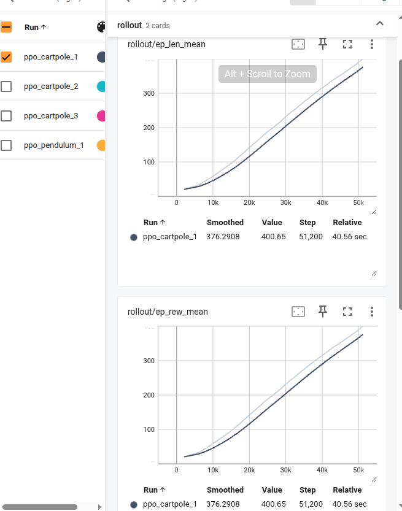
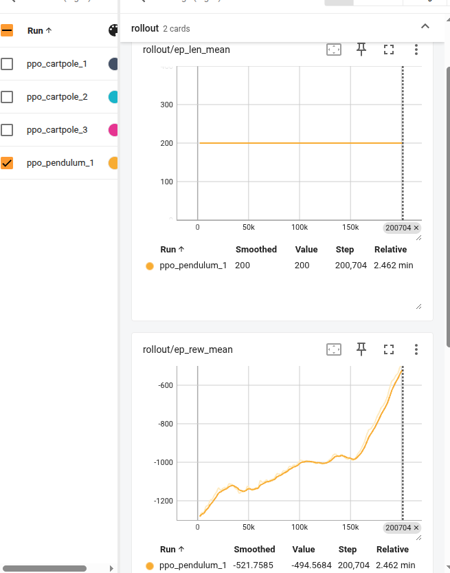

# Day 1: PPO on CartPole-v1

## 今日目标

1. 创建miniconda环境、新建工程、提交git
2. 用 Stable-Baselines3 的 PPO 算法训练 CartPole-v1，并完成训练、保存模型、加载模型、评估模型和录制视频。
3. 将模型替换为pendulum，完成训练、保存模型、加载模型、评估模型和录制视频,并简单理解不同环境训练效果的不同评估办法。
4. 熟悉markdown使用，Ctrl + Shift + V,会打开Markdown预览,Ctrl + W关闭、代码快书写方式

## 任务1

1. 创建仓库目录
   打开终端，执行：

   ```bash
   cd ~
   mkdir rl-week-practice
   cd rl-week-practice
   git init
   ```

   检查：
   ```bash
   pwd
   git status
   ```
   你应该看到当前位置类似：
   ```bash
   /home/zhangyue/rl-week-practice
   ```
   ```bash
   git status 
   ```
   应该显示这是一个空仓库。

2. 创建目录结构
   
   继续在 ~/rl-week-practice 里执行：
   ```bash
   mkdir -p 01_sb3_cartpole/models
   mkdir -p 01_sb3_cartpole/logs
   mkdir docs
   ```
   检查：
   ```bash
   find . -maxdepth 3 -type d | sort
   ```
   你应该看到：
   ```bash
   .
   ./01_sb3_cartpole
   ./01_sb3_cartpole/logs
   ./01_sb3_cartpole/models
   ./docs
   ```
3. 创建 .gitignore

   在仓库根目录创建：
   ```bash
   code .gitignore
   ```
   写入：
   ```bash
   __pycache__/
   *.pyc
   .ipynb_checkpoints/

   logs/
   runs/
   wandb/

   .venv/
   .env

   *.mp4
   *.avi

   .DS_Store
   ```
4. 创建总 README
   ```bash
   code README.md
   ```
   写入内容

5. 激活 Conda 环境
   ```bash
   conda activate rl-week
   python --version
   which python
   ```
   应该看到：
   ```bash
   Python 3.10.x
   /home/zhangyue/miniconda3/envs/rl-week/bin/python
   ```
6. 安装今天需要的依赖

   在 rl-week 环境激活后执行：
   ```bash
   pip install "stable-baselines3[extra]" gymnasium tensorboard
   ```
   安装完成后检查：
   ```bash
   python -c "import stable_baselines3; import gymnasium;
   print(stable_baselines3.__version__); print(gymnasium.__version__)"
   ```
7. 写训练脚本

   创建文件：
   ```bash
   code 01_sb3_cartpole/train_cartpole.py
   ```
   写入内容
8. 提交git

   查看当前状态,看哪些文件被修改、哪些文件未跟踪。
   ```bash
   git status
   ```
   查看具体改了什么
   ```bash
   git diff
   ```
   如果是已经 git add 过的文件，查看暂存区：
   ```bash
   git diff --staged
   ```
   添加想提交的文件:

   添加单个文件：
   ```bash
   git add README.md
   ```
   添加某个目录：
   ```bash
   git add 01_sb3_cartpole
   ```
   添加当前目录所有改动：
   ```bash
   git add .
   ```
   新手可以先少用 git add .，避免把视频、缓存、日志都加进去。

   提交到本地仓库
   ```bash
   git commit -m "day 1: train PPO on CartPole"
   ```
   查看提交历史
   ```bash
   git log --oneline
   ```
   在github创建远程仓库,并本地连接,git remote是管理远程仓库，origin是远程仓库约定俗成的名字    
   ```bash
   cd /home/zhangyue/rl-week-practice
   git remote add origin https://github.com/你的用户名/rl-week-practice.git
   ```
   初次push到github，-u，让本地分支与远程分支建立联系
   ```bash
   git push -u origin master
   ```
   以后在当前本地分支再push
   ```bash
   git push 
   ```


## 任务2

对应程序：train_cartpole eval_cartpole

### 训练流程

1. 创建环境：`gym.make("CartPole-v1")`
2. 创建模型：`PPO("MlpPolicy", env)`3
3. 训练模型：`model.learn(total_timesteps=50_000)`
4. 保存模型：`model.save(...)`

### 评估流程

1. 创建环境：`gym.make("CartPole-v1")`
2. 加载模型：`PPO.load(...)`
3. 重置环境：`env.reset()`
4. 预测动作：`model.predict(obs, deterministic=True)`
5. 执行动作：`env.step(action)`
6. 统计每局 reward

### 运行命令
```bash
python train_cartpole.py
python eval_cartpole.py
tensorboard --logdir logs
```
## 任务3
对应程序：02_train_pendulum 02_eval_pendulum
### 环境修改

1. 一般只需修改传入环境名和文件命名，其他都有gym封装好
2. pendulum一般需要比CartPole训练总步数长一点，因为是连续动作空间，训练难度更大

### 训练效果评估
1. 观看评估视频：cartpole杆可以不倒，pendulum摆可以倒立在上方
2. 查看tensorboard

   ep_len_mean ：最近若干局 episode 的平均长度,即平均每一局坚持了多少步

   ep_rew_mean ：最近若干局 episode 的平均总奖励

   cartpole：理想状态是ep_len_mean曲线上升，ep_rew_mean曲线上升，因为坚持越久越好

   

   pendulum：重点看ep_rew_mean，理想状态是曲线从很低的负数逐渐上升；而ep_len_mean一直不变，因为episode长度通常固定（摆不会倒下，只会因为达到步数而停止训练）
   
   


